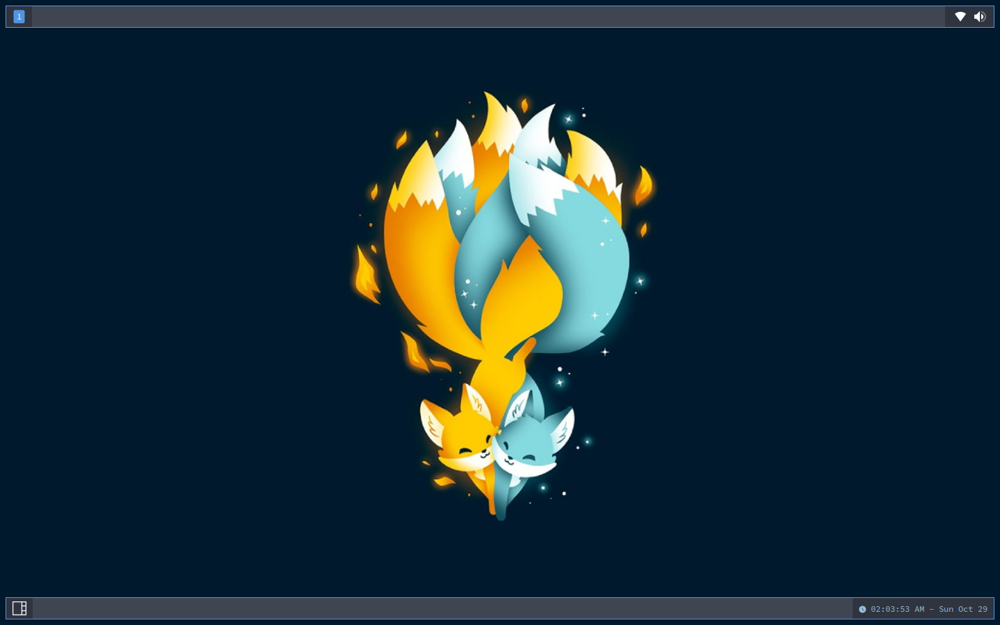

# Qtile Config

Just a backup of my Qtile configuration. Feel free to use it if you'd like <3

## Preview

## To Use

Simply copy and paste the `qtile` directory into `~/.config` and enjoy :3  

Please note: Some packages used in this config may not be installed on your system. Nothing should fully break, but please just keep that in mind. Just in case, I'll list some of the packages used below.  

-   feh
-   rofi
-   dmenu
-   thunar
-   picom
-   firefox
-   physlock
-   nm-applet
-   flameshot
-   volumeicon
-   xfce4-terminal
-   and obviously, qtile